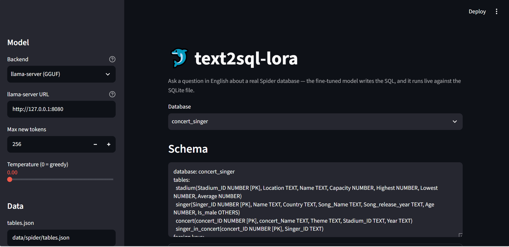
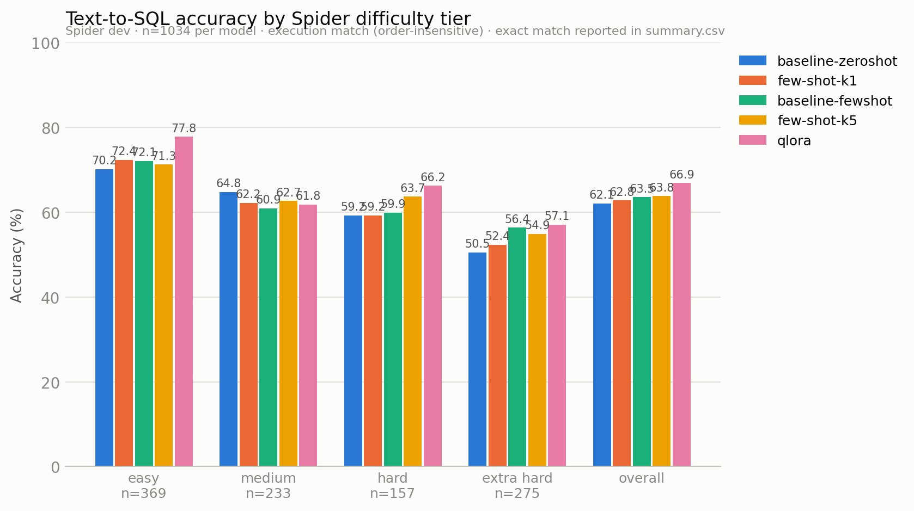

# text2sql-lora

**Fine-tuning a small open-source LLM for text-to-SQL with QLoRA — and evaluating it the honest way: every predicted query is executed against the real Spider database it was written for.**


[](https://colab.research.google.com/github/BenBrahimMazen/SQLora/blob/main/notebooks/finetune_colab.ipynb)


A complete, reproducible pipeline — no mocked steps, no synthetic data:

| | |
|---|---|
| **Task** | Natural-language question → SQLite query (Spider benchmark) |
| **Base model** | [Qwen2.5-Coder-3B-Instruct](https://huggingface.co/Qwen/Qwen2.5-Coder-3B-Instruct) (Apache-2.0) |
| **Fine-tuning** | QLoRA — 4-bit NF4 + LoRA adapters, sized for a single free-tier T4 (16 GB) |
| **Primary metric** | Execution accuracy: predicted vs gold result sets on the real Spider SQLite databases |
| **Data** | Public Spider release — 7,000 train / 1,034 dev questions across 166 databases, fetched at runtime |

## Demo



`src/demo_app.py` against `llama-server` running the q4_k_m-quantized model on a CPU-only machine: generation and sandboxed execution in one loop, no GPU anywhere in the path.

## Highlights

- **Execution-first evaluation, hardened.** Predicted SQL never touches a database file directly: each query runs against a read-only, in-memory copy of the database, behind an allowlist authorizer (reads only — no writes, DDL, `ATTACH`, or `PRAGMA`), with a wall-clock timeout enforced by an SQLite progress handler and a row-count cap. A malformed or hostile generated query is recorded as a failed example — never a crash, never a hang, never a corrupted database.
- **One code path from raw dataset to GGUF.** Download → instruction formatting → baseline prompting → QLoRA training → adapter merge → GGUF export → live Streamlit demo over the real databases.
- **Ablation-friendly by construction.** Every knob (model, LoRA `r`/`alpha`/target modules, LR, batch/accumulation, epochs, prompt-masking) lives in YAML with CLI overrides; each training run dumps its resolved config and full loss history next to the checkpoints, so any result can be traced to exactly the arguments that produced it.
- **Tested where it counts.** 60 offline tests cover the SQL normalizer, the schema serializer, and the execution sandbox (denied writes, denied `ATTACH`, timeout aborts, row caps). CI runs them on every push with nothing but pytest — no GPU, no downloads.
- **Methodology is documented, including its limits.** Difficulty tiers are a stated keyword-based approximation (the HF release ships no parsed-SQL labels); exact match uses a project-defined normalization. Both are described precisely below.

## Pipeline

```
scripts/download_spider.py ── HF datasets (questions + gold SQL)
        │                 └─ Spider databases + tables.json (166 SQLite files)
        ▼
src/preprocessing.py ─── schema + question → instruction records (train/dev .jsonl)
        │
        ├────────────────────────────┐                        │
        ▼                            │                        │
src/baseline_prompting.py           │   src/train_qlora.py   │
(zero-shot / k-shot baseline)       │   (QLoRA on a T4)      │
        │                            │        │               │
        │                            │        ▼               │
        │                            │   src/baseline_prompting.py --adapter …
        │                            │   (fine-tuned predictions)
        │                            │        │
        │                            │        ▼
        │                            │   src/merge_and_quantize.py (merge → GGUF)
        │                            │        │
        ▼                            ▼        ▼
src/evaluate.py  ── exact match + execution accuracy, CSV + chart, by difficulty tier
                                 │
                                 ▼
                    src/demo_app.py  ── Streamlit: ask a question, watch it run
```

## What the model sees

A real example from Spider dev (`data/processed/dev.jsonl`, first record):

```text
Database schema:
database: concert_singer
tables:
  stadium(Stadium_ID NUMBER [PK], Location TEXT, Name TEXT, Capacity NUMBER, Highest NUMBER, Lowest NUMBER, Average NUMBER)
  singer(Singer_ID NUMBER [PK], Name TEXT, Country TEXT, Song_Name TEXT, Song_release_year TEXT, Age NUMBER, Is_male OTHERS)
  concert(concert_ID NUMBER [PK], concert_Name TEXT, Theme TEXT, Stadium_ID TEXT, Year TEXT)
  singer_in_concert(concert_ID NUMBER [PK], Singer_ID TEXT)
foreign keys:
  concert.Stadium_ID -> stadium.Stadium_ID
  singer_in_concert.Singer_ID -> singer.Singer_ID
  singer_in_concert.concert_ID -> concert.concert_ID

Question: How many singers do we have?

Write one SQLite query that answers the question.
```

Target: `SELECT count(*) FROM singer`

Schemas are serialized from Spider's `tables.json` (tables, columns, types, primary and foreign keys) into this compact form by `src/preprocessing.py`; the chat template is applied later, so the same processed data works with any instruct model.

## Quickstart

```bash
python -m venv .venv && source .venv/bin/activate    # Windows: .venv\Scripts\activate
pip install -r requirements.txt

python scripts/download_spider.py    # real Spider: ~210 MB download, never committed
python src/preprocessing.py          # → data/processed/{train,dev}.jsonl
```

> `bitsandbytes` publishes no Windows wheels (marked Linux-only in `requirements.txt`), so **training runs on a hosted T4** — either upload this folder and use the same commands, or run [`notebooks/finetune_colab.ipynb`](notebooks/finetune_colab.ipynb), which drives the whole GPU phase (smoke tests → baselines → QLoRA → evaluation → artifact download) on a free Colab T4. Preprocessing, evaluation, tests, and the CPU-only GGUF demo work anywhere.

## Reproduce the benchmark

```bash
# 1. Baseline: zero-shot (repeat with --few-shot-k 3 for few-shot)
python src/baseline_prompting.py --out preds/baseline_zeroshot.jsonl

# 2. QLoRA fine-tuning (single T4)
python src/train_qlora.py --config configs/default.yaml

# 3. Fine-tuned predictions — same script, pointed at the adapter
python src/baseline_prompting.py --adapter outputs/qlora_run/final_adapter \
    --out preds/qlora.jsonl

# 4. Evaluate: exact match + execution accuracy, comparison CSV + chart
python src/evaluate.py \
    --pred baseline-zeroshot=preds/baseline_zeroshot.jsonl \
    --pred qlora=preds/qlora.jsonl

# 5. (optional) merge + GGUF for CPU inference, then the demo
python src/merge_and_quantize.py --adapter outputs/completion_only_run/final_adapter --gguf
#    add "--skip-merge --gguf --gguf-type q4_k_m" for the 1.8 GB quantized variant
#    of the 5.9 GB f16 file (needs a llama-quantize binary: build it or point
#    --llama-quantize at one from a prebuilt llama.cpp release zip)

llama-server -m outputs/completion_only_run/gguf/model-q4_k_m.gguf --port 8080
streamlit run src/demo_app.py    # Backend: "llama-server (GGUF)"
```

The GGUF path is how the demo runs on a machine with no GPU: `llama-server` serves the quantized model through an OpenAI-compatible API and the demo talks to it with the standard library alone — no `llama-cpp-python` build required. Smoke-tested on CPU (Ryzen, 16 GB RAM): 6/6 execution matches on a six-question dev sample, 3–16 s per query after warm-up.

Smoke-test before the full runs: `--limit 20` on inference, `--max-steps 10` on training.

## Training on a free T4 — defaults and budget

Defaults in `configs/default.yaml` are chosen to fit a 16 GB T4 with headroom:

| Setting | Default | Notes |
|---|---|---|
| Quantization | NF4, double-quant, fp16 compute | `bitsandbytes` |
| LoRA | r=16, α=32, dropout 0.05, all 7 linear projections | ~0.6% trainable params for a 3B model |
| Effective batch | 4 per-device × 4 accumulation = 16 | gradient checkpointing on (non-reentrant) |
| Sequence length | 1024 | Spider schemas are long; queries are short |
| Optimizer | `paged_adamw_8bit`, LR 2e-4, cosine + 3% warmup | 3 epochs |
| Validation | 2% held out of **train** | dev.jsonl is never trained or model-selected on |

Loss is logged every 10 steps and evaluated every 100; the full per-step history lands in `outputs/<run>/log_history.json`.

**Ablations** are one file each — copy `configs/default.yaml` (or pass flags):

```bash
python src/train_qlora.py --epochs 2 --output-dir outputs/epochs2
python src/train_qlora.py --response-template $'<|im_start|>assistant\n' --output-dir outputs/completion_only_run
```

The `$'…'` form passes a **real newline** — the template must match the tokenized chat template exactly, or every example is skipped in the loss (uncommenting `training.response_template` in the YAML works too; YAML turns `\n` into a newline for you).

## Evaluation methodology

**Execution accuracy (primary).** For each dev example, predicted and gold SQL both execute against that example's Spider database inside the sandbox described above. Result sets compare as order-insensitive multisets by default (`--order-sensitive` for ordered comparison); floats compare at 4-decimal rounding and `3 == 3.0` (SQLite semantics). Results are reported overall and per difficulty tier. As a harness sanity check, gold-vs-gold execution on the dev set scores 100% — the evaluator itself introduces no errors.

**Exact match (secondary).** Comparison after `src/sql_normalization.py`: whitespace/casing/trailing-semicolon, quote style (`"x"` ≡ `'x'`), operator spacing and `<>` ≡ `!=`, parenthesis/comma spacing, and alphabetical sorting of the top-level SELECT list (projection order doesn't change a result set). This is a project-defined normalization, not the official Spider test-suite metric — documented limitations live in the module docstring.

**Difficulty tiers.** The HuggingFace release ships no parsed-SQL labels, so tiers come from `estimate_difficulty()`, a keyword-based approximation of the official Spider hardness rules (components counted: WHERE / GROUP BY / ORDER BY / HAVING / JOIN / aggregation; nesting and set operations escalate). Tiers are computed once at download time and used consistently in training data, predictions, and evaluation, so per-tier comparisons across model variants are apples-to-apples.

## Configuration

One YAML drives every entry-point script; CLI flags override individual values:

```
configs/default.yaml  <  --config <your.yaml>  <  CLI flags
```

```yaml
lora:
  r: 16
  lora_alpha: 32
  lora_dropout: 0.05
  target_modules: [q_proj, k_proj, v_proj, o_proj, gate_proj, up_proj, down_proj]

training:
  num_train_epochs: 3
  per_device_train_batch_size: 4
  gradient_accumulation_steps: 4
  learning_rate: 2.0e-4
  # response_template: "<|im_start|>assistant\n"   # completion-only loss
```

## Project structure

```
text2sql-lora/
├── scripts/download_spider.py   # fetch real Spider (questions, SQL, databases)
├── notebooks/finetune_colab.ipynb  # one-click GPU phase on a free Colab T4
├── src/
│   ├── preprocessing.py         # schema serialization → instruction format
│   ├── baseline_prompting.py    # zero/few-shot + fine-tuned inference
│   ├── train_qlora.py           # QLoRA: bnb 4-bit + peft + trl SFTTrainer
│   ├── merge_and_quantize.py    # merge adapter → standalone model → GGUF
│   ├── sql_normalization.py     # exact-match normalization
│   ├── execution_eval.py        # sandboxed execution accuracy, per-tier breakdown
│   ├── evaluate.py              # orchestration: CSV + grouped bar chart
│   └── demo_app.py              # Streamlit demo over the real databases
├── tests/                       # 60 offline tests (stdlib-only modules under test)
├── configs/default.yaml         # every knob, YAML + CLI overridable
└── .github/workflows/ci.yml     # offline suite on every push
```

Every module starts with a docstring explaining what it does and where it sits in the pipeline.

## Testing

```bash
python -m pytest tests -q     # 60 passed — no network, no model, no GPU
```

The three modules the tests cover (`sql_normalization`, `execution_eval`, `preprocessing`) import only the standard library by design, so CI stays a 30-second job.

## Results

All 1,034 Spider dev questions, one run per model, greedy decoding. Per-query evidence (question, gold and predicted SQL, execution outcome) is committed under `results/`; the training loss history is at `outputs/qlora_run/log_history.json` (train 1.70 → 0.07, eval 0.204 → 0.101 over 1,280 steps).

| Model | Exact Match | Execution Accuracy (overall) | Execution Accuracy (easy) | Execution Accuracy (medium) | Execution Accuracy (hard) | Execution Accuracy (extra hard) |
|-------|-------------|------------------------------|---------------------------|-----------------------------|---------------------------|---------------------------------|
| Qwen2.5-Coder-3B-Instruct (zero-shot) | 27.7 | 62.1 | 70.2 | 64.8 | 59.2 | 50.5 |
| Qwen2.5-Coder-3B-Instruct (few-shot, k=1) | 38.1 | 62.8 | 72.4 | 62.2 | 59.2 | 52.4 |
| Qwen2.5-Coder-3B-Instruct (few-shot, k=3) | 35.5 | 63.5 | 72.1 | 60.9 | 59.9 | 56.4 |
| Qwen2.5-Coder-3B-Instruct (few-shot, k=5) | 39.4 | 63.8 | 71.3 | 62.7 | 63.7 | 54.9 |
| + QLoRA fine-tuned | 50.6 | 66.9 | 77.8 | 61.8 | 66.2 | 57.1 |
| + QLoRA fine-tuned (completion-only loss) | 58.6 | 74.9 | 85.6 | 76.4 | 75.2 | 58.9 |



Reading it: fine-tuning lifts execution accuracy on every tier except medium (62.1 → 66.9 overall) and nearly doubles exact match (27.7 → 50.6) — the model internalizes Spider's SQL dialect more than it gains new query ability. The few-shot sweep shows the same shape from the other side: a single exemplar already buys +10.4 exact match but only +0.7 execution accuracy, and five exemplars add little more (+1.7 execution accuracy over zero-shot in total) — exemplars teach the output format, not the databases. The one knob that moves execution accuracy substantially is loss masking: the same QLoRA recipe trained with completion-only loss (`training.response_template`) gains another +8.0 exact match and +8.0 execution accuracy (66.9 → 74.9), lifting medium from 61.8 to 76.4 and hard from 66.2 to 75.2. With schemas roughly an order of magnitude longer than the answers, full-sequence loss spends most of its gradient learning to recite schema text; masking the prompt points every optimization step at the SQL. Query validity tracks the same story — malformed predictions fall from 157 (zero-shot) to 144 (k=5) to 102 (fine-tuned) to 56 (completion-only). Every row is one run, one seed, nothing tuned on dev.

How much of that is noise? Bootstrapping the committed per-query outcomes (10,000 resamples, `scripts/bootstrap_ci.py`) puts one run's overall execution accuracy within about ±3 points at 95% — the four prompt-based rows (62.1–63.8) sit inside a single interval. Paired resampling, drawing the same questions for both models, separates the real effects from the noise: QLoRA over zero-shot is +4.8 [+1.9, +7.6] and completion-only over full-sequence loss +7.9 [+5.4, +10.3], both excluding zero; the few-shot deltas (+0.7, +1.7) include it.

## Data & licenses

- **Spider** — Yale LILY, CC BY-SA 4.0. Questions/SQL via the [HuggingFace release](https://huggingface.co/datasets/xlangai/spider); SQLite databases and `tables.json` via the original release's packaging. ~10,181 questions, 166 databases.
- **Qwen2.5-Coder-3B-Instruct** — Apache 2.0.
- The raw dataset is never committed — `scripts/download_spider.py` fetches and verifies it at runtime (all referenced `db_id`s resolve to database files). The only Spider text committed is the per-query evaluation evidence under `results/` (question + gold and predicted SQL for the 1,034 public dev questions), redistributed under the same CC BY-SA 4.0 terms.
